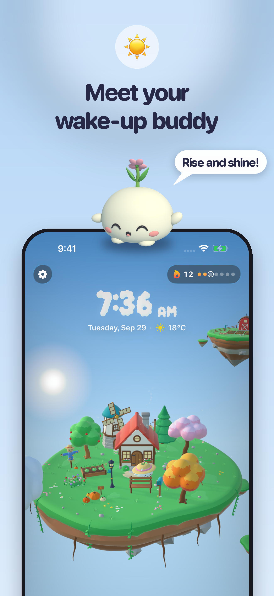
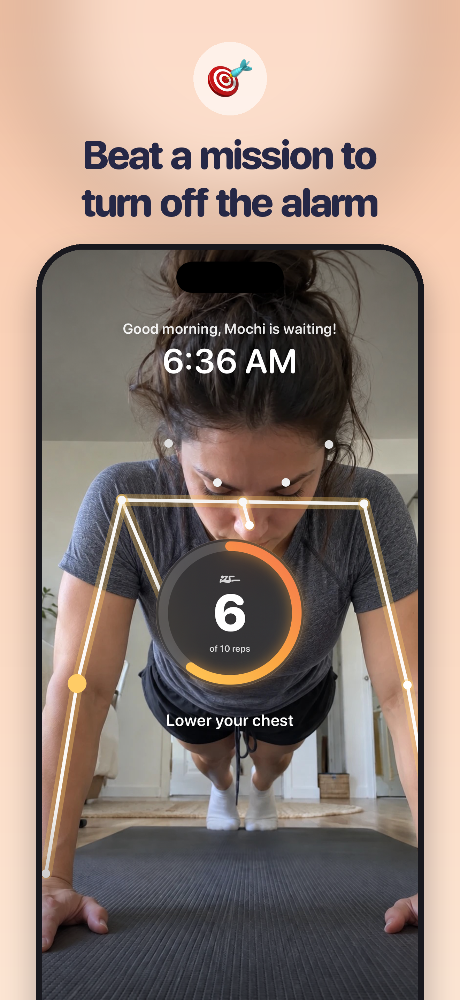
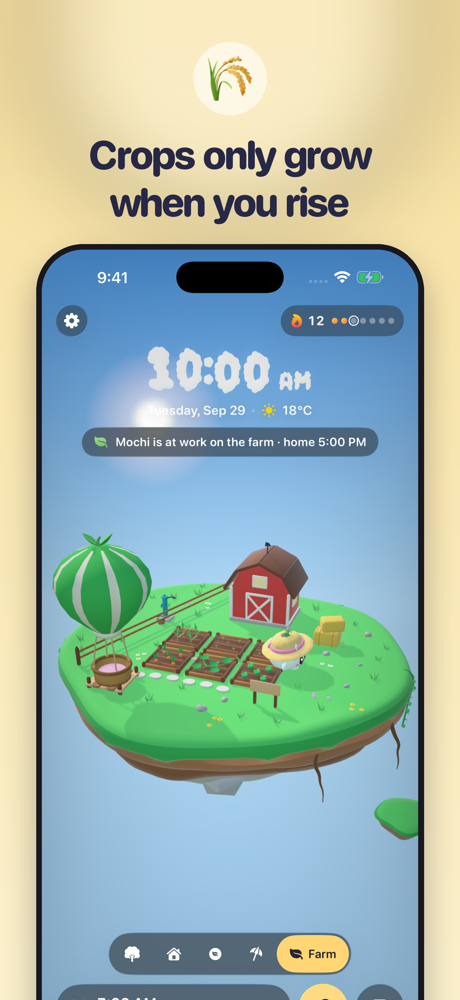

# Riser: Alarm Buddy ☀️

**Gamified accountability for chronic snoozers.** Riser is an iOS alarm you switch off by finishing a quick wake-up mission (push-ups or squats counted by the camera, an item hunt, or mental math). Every morning you win, your wake-up buddy flies off to work and grows a cozy 3D floating island with you.

Built by James Rellera, a student at Ateneo de Manila University, for **RevenueCat Shipaton 2026**.

- App Store: https://apps.apple.com/app/id6817230193
- Website: https://withriser.com

<p align="center">  </p>

## Features
- **Real system alarm** with Apple AlarmKit: rings like the built-in Clock app, even when the phone is locked.
- **Camera-counted push-ups and squats** with Vision body-pose detection, side-on or facing the camera (knee push-ups count too). Runs entirely on device; nothing is recorded or uploaded.
- **Item Hunt** (on-device image classification) and **Brain Warm-up** (mental math).
- **Escape-proof mode:** stop the alarm or quit mid-mission and it rings again until the mission is done (with a hard stop after an hour).
- **A companion game:** the buddy commutes by balloon to the Farm Island, harvests crops and earns coins. Crops only grow on mornings you win; miss mornings and the crops wilt and the buddy catches a cold. Build, decorate the home, expand to new islands, take vacations on days off.
- **A real sky:** sun and moon positioned for your location and time, live weather from WeatherKit.
- **Riser+ subscription with RevenueCat:** 3-day free trial on yearly, monthly and lifetime plans, trial eligibility checks, Restore Purchases. No backend and no accounts.

## Build it
Requirements: Xcode 26 (iOS 26 SDK), [XcodeGen](https://github.com/yonaskolb/XcodeGen), an Apple developer account.

```bash
brew install xcodegen
xcodegen generate
open Riser.xcodeproj
```

1. In `project.yml`, replace `YOUR_TEAM_ID` with your Apple Developer Team ID (and change the bundle IDs if you're signing it yourself), then run `xcodegen generate` again.
2. In `Riser/Sources/Services/PurchaseService.swift`, paste your RevenueCat keys: a Test Store key (`test_…`) for Debug builds and an Apple key (`appl_…`) for Release. Create an entitlement `riser_pro` and an offering `default` with annual, monthly and lifetime packages. Without keys the app still runs; purchases are just unavailable.
3. Live weather needs the WeatherKit capability on your App ID.
4. Camera missions need a real iPhone. In the simulator, DEBUG builds can use the launch arguments in `RiserApp.swift` (for example `-demoHome YES`) to skip onboarding.

## Project layout
| Path | What |
|---|---|
| `project.yml` | XcodeGen spec (app + Live Activity widget) |
| `Riser/Sources/App` | App entry and `AppModel` (economy, streaks, building, routing) |
| `Riser/Sources/Services` | AlarmKit alarms and escape-proof follow-ups, sky and weather, sound, notifications, RevenueCat |
| `Riser/Sources/Missions` | Vision pose rep counter (push-ups, squats), Item Hunt |
| `Riser/Sources/Model` | Game state: farm, career, buildables, interiors, adventures, achievements |
| `Riser/Sources/World` | SceneKit island: buddy AI and pathfinding, critters, cloud clock, models |
| `Riser/Sources/Views` | SwiftUI screens |
| `RiserWidgets/` | AlarmKit Live Activity |
| `Shared/` | Types shared between the app and the widget |
| `Riser/Resources` | USDZ models, sounds, textures |
| `Blender/` | Python scripts that build every 3D model (`build.py`) and the `.blend` sources |
| `Audio/synth.py` | Regenerates the sound effects and alarm tones |
| `site/` | The withriser.com website |

## License
Riser is released under the **GNU General Public License v3.0** (see [LICENSE](LICENSE)). That covers the code and the original assets in this repository (3D models, sounds, images). If you distribute a modified version, it must be released under the same license with its source code.
